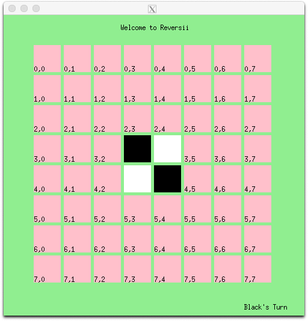

# My Reversii 
Programmed using C++ with a bash interface.   

# Commands
Let n be some even number greater than 3 and less than 20.  
Let x, y be some number in the boards coordinates.  

_./MyReversii_: Plays the makefile   
_new n_: Create a new board    
_play x y_ : Sets a piece at the x, y coordinates   

# Setup
Requires the downloading XQuartz or some graphic displayer for play.  

# Demonstation
Graphic Display  
  

Text Display on Bash
  
