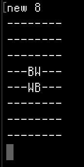

# My Reversii 
Reversi is a strategy board game for two players, played on an 8×8 uncheckered board. There are sixty-four identical game pieces called disks (often spelled "discs"), which are light on one side and dark on the other. Players take turns placing disks on the board with their assigned color facing up. The game is programmed using C++ with a bash interface.    

## Commands
Let n be some even number greater than 3 and less than 20.  
Let x, y be some number in the boards coordinates.  

_./MyReversii_: Plays the makefile   
_new n_: Create a new board    
_play x y_ : Sets a piece at the x, y coordinates   

## Setup
Requires the downloading XQuartz or some graphic displayer for play.  

## Demo
Graphic Display  
     

Text Display on Bash  
  

