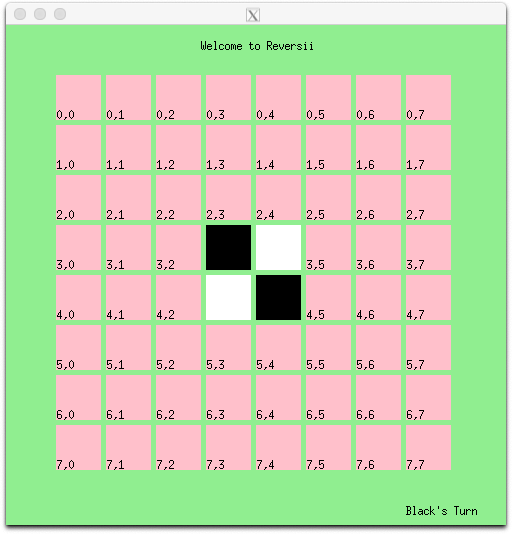
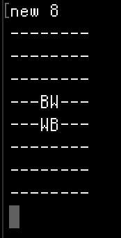

# My Reversii
The classic Reversi is a strategy board game for two players, played on an 8×8 uncheckered board. There are sixty-four identical game pieces called disks (often spelled "discs"), which are light on one side and dark on the other. Players take turns placing disks on the board with their assigned color facing up.

In my version of the game, players can choose the size of the board. The game is programmed using C++ with a bash interface.    


## Commands
Let n be some even number greater than 3 and less than 20.  
Let x, y be some number in the boards coordinates.  


```
./MyReversii : Plays the makefile   
new n : Create a new board    
play x y : Sets a piece at the x, y coordinates   
```


## Demo
Graphic Display  
     


Text Display on Bash  
  


## Setup
Requires the downloading XQuartz or some graphic displayer to play. Extended from OOSD course.
